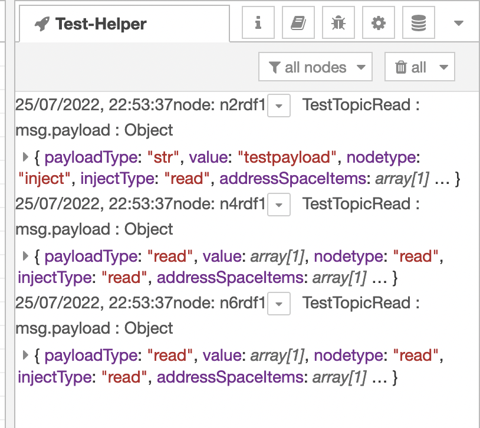

# node-red-contrib-helper

## The test helper node toolbox contribution package for visual Node-RED package testing.

This contribution is a package of the PLUS for Node-RED Community and helps 
to build visual flows in [Node-RED][1] for [the node-red-node-test-helper][3] tests.

## International IIoT Website for Node-RED

For an international area, [Iniationware][4] has provided the [PLUS for Node-RED International][5] website.

## IIoT Webseite Deutschland für Node-RED

Für einen deutschsprachigen Bereich hat [Iniationware][4] die Webseite [PLUS for Node-RED Germany][6] bereitgestellt.

### For Testers

Report issues, share your experiences, record tutorials,
write Wiki articles and Blogs to share more about this package, please!

### Helper Flow Example

This example shows the helper node from the "node-red-node-test-helper".

### Helper Message Board

The message board shows just the helper node messages from the "node-red-node-test-helper".
That means you have no spam inside the debug tab.

## Contributors

- 2022 [Klaus Landsdorf][2]

[1]:https://nodered.org
[2]:https://github.com/biancode
[3]:https://github.com/node-red/node-red-node-test-helper
[4]:https://github.com/Iniationware
[5]:https://www.noderedplus.de/
[6]:https://www.noderedplus.de/de/
